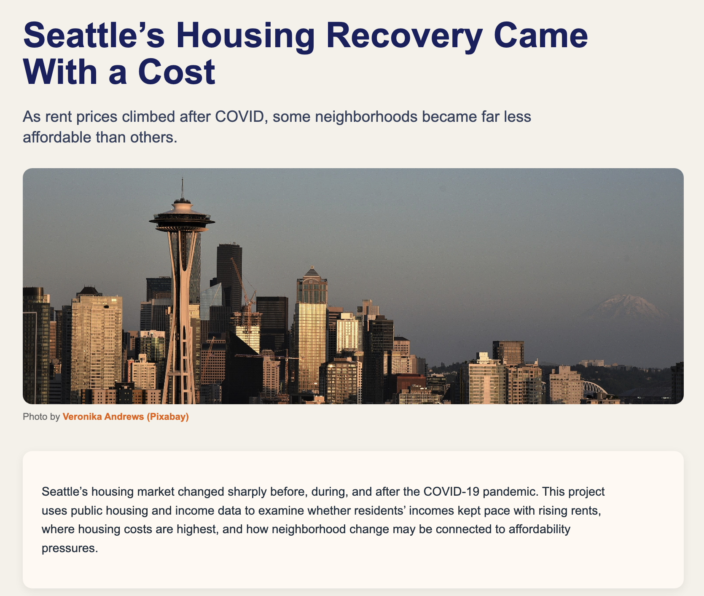
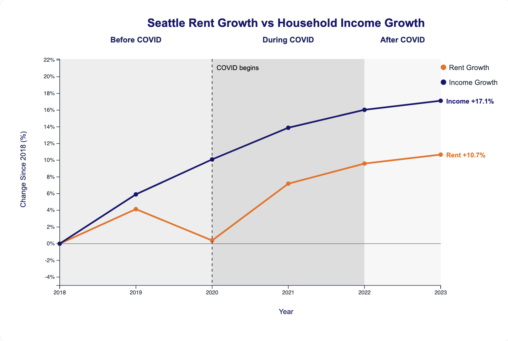
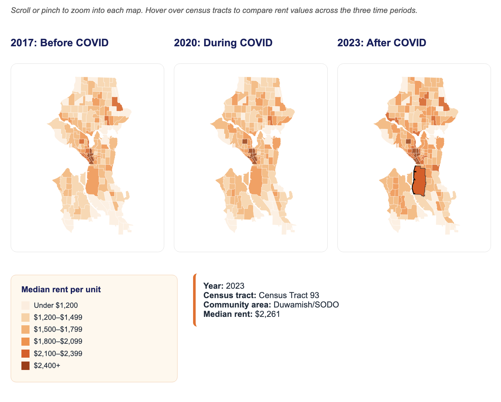
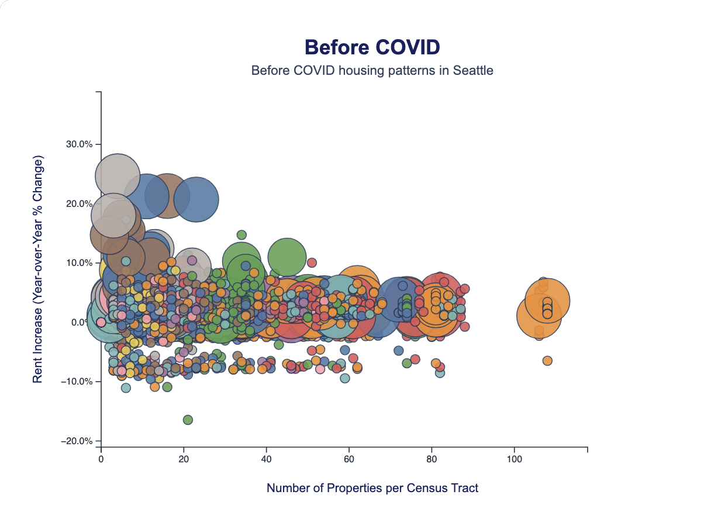
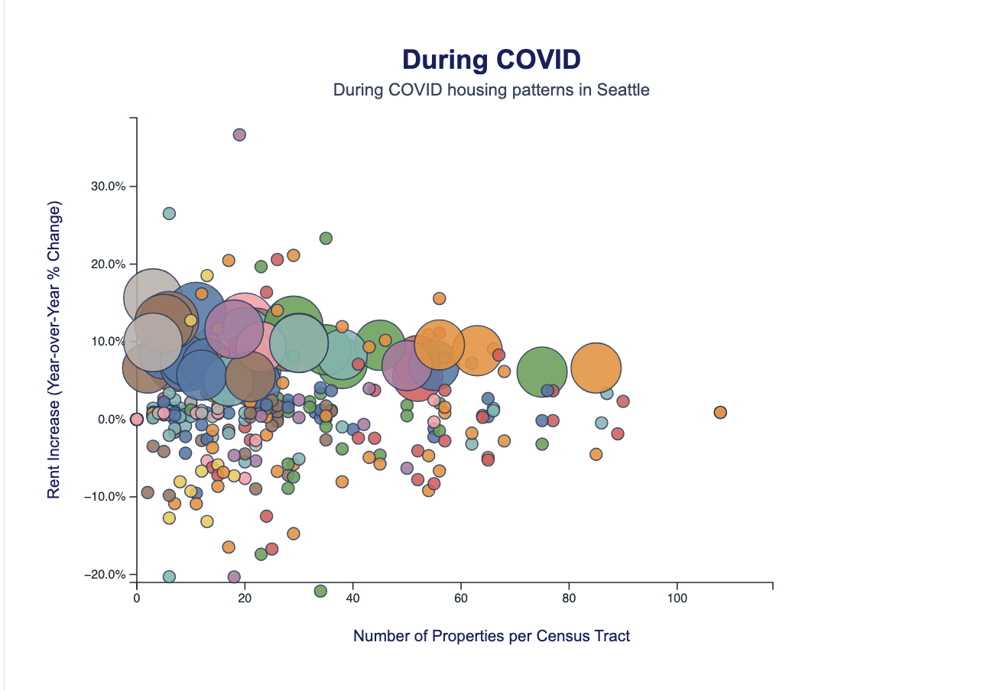
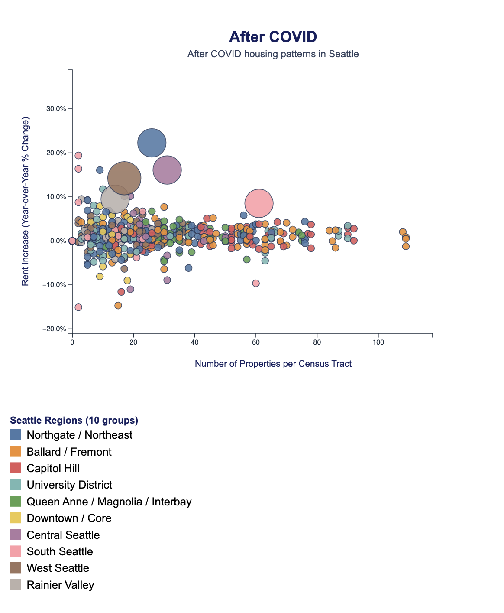

# Seattle's Housing Recovery Came With a Cost

## Overview

This project explores how housing affordability changed in Seattle before, during, and after the COVID-19 pandemic. Using public housing, income, and neighborhood-level datasets, our team investigated whether rising household incomes kept pace with increasing rent prices and how housing pressure varied across Seattle neighborhoods.

The project combines multiple interactive visualizations to tell a data-driven story about Seattle's housing recovery and affordability challenges.

---

## Project Website

Live Website:  
[Insert GitHub Pages URL Here]

---

## Team Members

- Alejandra Chavarria
- Yahya Diallo
- Rishita Bonepalli

---

## Research Question

How did housing affordability change across Seattle neighborhoods before, during, and after COVID-19, and did household income growth keep pace with rising rents?

---

## Visualizations

### 1. Rent Growth vs Household Income Growth

This interactive line chart compares average apartment rent growth and median household income growth from 2018 through 2023. The chart highlights differences between housing costs and income trends across the COVID period.

#### Screenshot

---

### 2. Seattle Rent Pressure Maps

These choropleth maps compare median apartment rents across Seattle census tracts in 2017, 2020, and 2023. Consistent color scales allow viewers to identify where rent pressure remained concentrated and how affordability changed spatially over time.

Features include:

- Interactive hover information
- Shared legend
- Zoom functionality
- Consistent rent categories across years

#### Screenshot

---

### 3. Neighborhood Change and Housing Pressure

This scatterplot section compares neighborhood-level housing indicators before, during, and after COVID. Bubble size, color, and position help viewers explore relationships between rent pressure, housing activity, and neighborhood concern.

#### Screenshot

---

## Key Findings

### Income Growth Outpaced Rent Growth

Median household income increased more rapidly than average apartment rents between 2018 and 2023.

### Housing Pressure Remained Concentrated

Several high-rent areas remained consistently expensive throughout the COVID period, particularly in and around central Seattle.

### Affordability Challenges Persisted

Although incomes increased, housing costs remained elevated after COVID and affordability pressures continued to affect many neighborhoods.

---

## Datasets

### Apartment Market Rent Prices by Census Tract

Seattle Open Data

https://data.seattle.gov/dataset/Apartment-Market-Rent-Prices-by-Census-Tract/h27p-5k3i/about_data

### Single Family Home Flips by Census Tract

Seattle Open Data

https://data.seattle.gov/dataset/Single-Family-Home-Flips-by-Census-Tract/e9ve-4v8v/about_data

### Seattle Median Household Income

Neilsberg

https://www.neilsberg.com/insights/seattle-wa-median-household-income/

---

## Tools Used

- HTML
- CSS
- JavaScript
- D3.js
- GitHub Pages

---

## References

### D3 Resources

- https://d3js.org/
- https://d3js.org/d3-geo
- https://d3js.org/d3-zoom

### Choropleth Resources

- https://d3-graph-gallery.com/choropleth.html
- https://d3-graph-gallery.com/graph/choropleth_basic.html
- https://observablehq.com/@d3/choropleth

### Additional Mapping Resources

- https://observablehq.com/@didoesdigital/about-choropleth-maps

---

## Project Structure

text project-folder/ │ ├── index.html ├── style.css ├── main.js ├── yahya_linechart.js ├── rishita_scatterplot.js │ ├── datasets/ │   ├── RentTypology.geojson │   ├── RentTypology.csv │   └── other datasets │ ├── images/ │   ├── hero-image.jpg │   ├── linechart-screenshot.png │   ├── choropleth-screenshot.png │   └── scatterplot-screenshot.png │ └── README.md 

## Future Improvements

- Additional neighborhood demographic analysis
- Mobile-specific map interactions
- Time-slider map animation
- Expanded affordability metrics beyond rent and income
